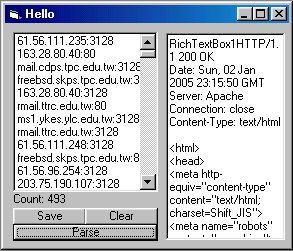



## \_Parse Proxies From Cybersyndrome\.net\_

### Description

Parses the non-anon proxies from cybersyndrome.net/pld.html
 
### More Info
 
Me = Newbie + Dumb***

Proxies in a listbox (format proxy:port)

I have no clue..

             |
---                |---
**Submitted On**   |2005-01-02 15:12:12
**By**             |[Richard V\.](https://github.com/Planet-Source-Code/PSCIndex/blob/master/ByAuthor/richard-v.md)
**Level**          |Beginner
**User Rating**    |4.8 (19 globes from 4 users)
**Compatibility**  |VB 6\.0
**Category**       |[String Manipulation](https://github.com/Planet-Source-Code/PSCIndex/blob/master/ByCategory/string-manipulation__1-5.md)
**World**          |[Visual Basic](https://github.com/Planet-Source-Code/PSCIndex/blob/master/ByWorld/visual-basic.md)
**Archive File**   |[Parse\_Prox183584122005\.zip](https://github.com/Planet-Source-Code/richard-v-parse-proxies-from-cybersyndrome-net__1-58067/archive/master.zip)

